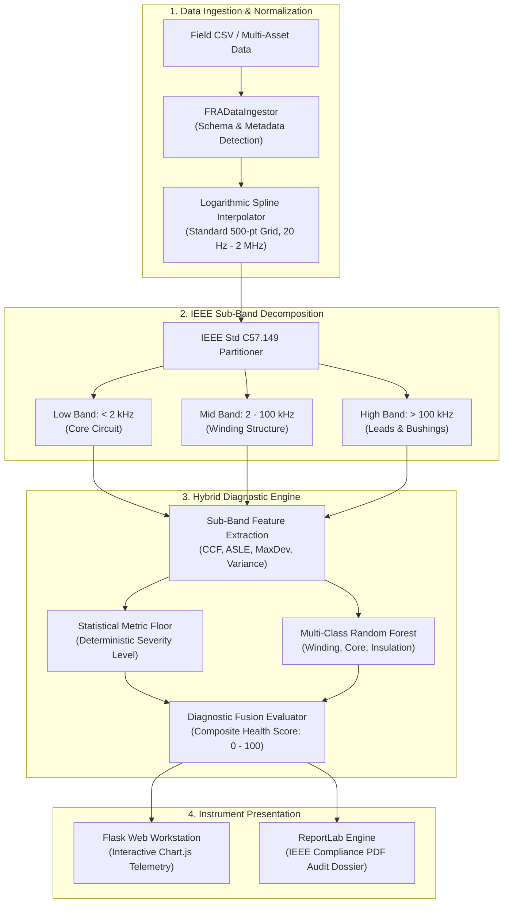

<div align="center">


# FRA Intelligence Workstation

**Standards-Grounded Sweep Frequency Response Analysis (SFRA) & Transformer Diagnostics**

[](https://www.python.org/)
[](https://flask.palletsprojects.com/)
[](https://standards.ieee.org/)
[](tests/)
[](https://www.reportlab.com/)

[Overview](#overview) • [Key Features](#key-features) • [Architecture](#architecture) • [Getting Started](#getting-started) • [Usage](#usage) • [Diagnostic Standards](#diagnostic-standards) • [Project Structure](#project-structure)

</div>

---

## Overview

The **FRA Intelligence Workstation** is a high-trust engineering instrument platform designed for high-voltage power transformer condition assessment using **Sweep Frequency Response Analysis (SFRA)**. Built in strict alignment with **IEEE Std C57.149™-2012** and **IEC 60076-18**, the workstation transforms raw spectral sweeps into actionable, physics-grounded diagnostic intelligence.

Unlike black-box AI tools or proprietary OEM desktop software, this platform enforces a **deterministic physics floor**: machine learning models can escalate risk upon detecting anomalous spectral patterns, but can never downgrade mathematically deviant sub-band signatures.

```
       Raw SFRA Sweep (20 Hz – 2 MHz)
                     │
                     ▼
       Logarithmic Grid Interpolation (500 pts)
                     │
                     ▼
       IEEE C57.149 Sub-Band Partitioning
       ├── Low Band (< 2 kHz)     ── Core & Magnetizing Inductance
       ├── Mid Band (2 – 100 kHz) ── Winding Geometry & Capacitance
       └── High Band (> 100 kHz)  ── Leads, Bushings & Grounding
                     │
                     ▼
       Hybrid Diagnostic Fusion Engine
       ├── Statistical Cross-Correlation (CCF, ASLE, MaxDev)
       └── Random Forest Multi-Class Fault Classifier
                     │
                     ▼
       Interactive Bode Workbench & IEEE Audit PDF Report
```

> [!NOTE]
> Power transformers represent critical capital assets. Operational decisions such as de-tanking or winding unclamping carry massive financial and safety consequences. The platform ensures that all diagnostic outputs correlate directly to measurable physical resonance shifts ($\Delta f$), magnitude deviations ($\Delta\text{dB}$), and sub-band cross-correlation coefficients ($\rho$).

---

## Key Features

- **IEEE Std C57.149 & IEC 60076-18 Sub-Band Architecture**  
  Deconstructs frequency response curves into standardized physical zones: Low (< 2 kHz for core anomalies), Medium (2 kHz – 100 kHz for axial/radial winding deformations), and High (> 100 kHz for lead and tap changer issues).

- **Physics-First Hybrid Diagnostic Fusion**  
  Couples statistical correlation metrics (Cross-Correlation Factor $CCF$, Absolute Sum of Logarithmic Error $ASLE$, Maximum Decibel Deviation) with a trained multi-class Random Forest classifier. AI predictions operate under a deterministic safety floor to guarantee conservative engineering assessments.

- **Universal Multi-Asset CSV Ingestion**  
  Smart schema detection automatically parses varying vendor column nomenclatures (`Frequency`, `Hz`, `Magnitude`, `Gain (dB)`, `Phase`), distinguishes phase angle measurements from winding metadata, and seamlessly handles multi-sweep batch records.

- **Logarithmic Preprocessing & Standardization**  
  Maps non-uniform field sweep acquisitions onto an optimized 500-point logarithmic grid spanning 20 Hz to 2 MHz using cubic spline and linear fallback interpolation, eliminating measurement noise and vendor point-count discrepancies.

- **Interactive Telemetry Workbench**  
  Browser-based instrument console featuring responsive logarithmic Bode magnitude and phase plots via Chart.js, dynamic sub-band boundary highlighting, and real-time health index scoring.

- **Automated Engineering Audit Reports**  
  Generates publication-quality, standards-compliant PDF inspection dossiers via ReportLab, complete with high-resolution vector Bode comparisons, tabular sub-band metrics, confidence intervals, and recommended utility action protocols (DGA, internal de-tanking, or routine surveillance).

- **Fleet History & Baseline Registry**  
  Maintains asset health records, baseline references, and diagnostic audit trails across multi-substation transformer fleets.

---

## Architecture

The system operates as a modular Python pipeline that can be driven via the interactive web workstation, standard CLI scripts, or integrated directly into utility asset management software:



---

## Getting Started

### Prerequisites

- **Python**: Version `3.11` or `3.12`
- **Operating System**: Windows, Linux, or macOS

### Installation

1. **Clone the repository**:
   ```bash
   git clone https://github.com/your-org/fra-ai-data.git
   cd fra-ai-data
   ```

2. **Create and activate a virtual environment**:
   ```bash
   # On macOS/Linux
   python3 -m venv venv
   source venv/bin/activate

   # On Windows (PowerShell)
   python -m venv venv
   .\venv\Scripts\Activate.ps1
   ```

3. **Install required dependencies**:
   ```bash
   pip install -r requirements.txt
   ```

> [!TIP]
> No Node.js or frontend compilation build step is required. The web workstation consumes CDN-delivered Tailwind CSS, Lucide icons, and Chart.js runtime libraries.

---

## Usage

### 1. Launching the Web Workstation

Start the local Flask development server:

```bash
python app/app.py
```

Open your browser and navigate to:
```text
http://127.0.0.1:5000/
```

- **Overview (`/`)**: System introduction, IEEE standards background, and quick start links.
- **SFRA Workbench (`/analysis`)**: Upload test CSV sweeps, select baseline curves, inspect interactive Bode plots, and export PDF reports.
- **Fleet Records (`/history`)**: Review historical transformer asset assessments and health statuses.
- **Standards & Guide (`/about`)**: Technical reference for IEEE Std C57.149 sub-band physics and mathematical formulas.

### 2. Running via Python Pipeline API

Process raw sweeps directly in Python scripts:

```python
from src.pipeline import run_pipeline

# Analyze an uploaded sweep against the default or a specific baseline
results = run_pipeline(
    uploaded_data="data/raw/fra_faulty.csv",
    baseline_data="data/raw/fra_healthy.csv",
    generate_pdf=True,
    pdf_output_path="reports/audit_report.pdf"
)

# Inspect diagnostic findings
primary = results[0]
print(f"Asset ID:        {primary.get('transformer_id', 'Unknown')}")
print(f"Status:          {primary['status']}")
print(f"Fault Type:      {primary['fault_type']}")
print(f"Correlation:     {primary['correlation']:.4f}")
print(f"Max Deviation:   {primary['shift']:.2f} dB")
print(f"Composite Score: {primary['composite_score']}/100")
print(f"Recommendation:  {primary['recommendation']}")
```

### 3. Running Standalone Script

Execute the built-in end-to-end verification script:

```bash
python main.py
```

---

## Diagnostic Standards

The platform enforces IEEE Std C57.149 sub-band frequency partitions and correlation classification thresholds:

| Sub-Band | Frequency Range | Dominant Physical Parameters | Typical Failure Modes |
|:---|:---|:---|:---|
| **Low (LF)** | $< 2\text{ kHz}$ | Core magnetizing inductance ($L_m$), magnetic circuit reluctance | Core displacement, damaged grounding straps, open laminations |
| **Medium (MF)** | $2\text{ kHz} - 100\text{ kHz}$ | Main winding inductances ($L_w$), inter-winding & ground capacitances ($C_{w}$, $C_{g}$) | Axial winding collapse, radial hoop buckling, coil displacement |
| **High (HF)** | $> 100\text{ kHz}$ | Winding leads, bushing capacitances ($C_b$), tap changer lead geometry | Loose tap connections, lead displacement, grounding artifact noise |

### Sub-Band Assessment Criteria

```
  Sub-Band CCF (ρ)       Classification      Required Utility Action
  ──────────────────────────────────────────────────────────────────────────
  ρ ≥ 0.98               Healthy             Normal condition. Routine cycle.
  0.90 ≤ ρ < 0.98        Warning             Schedule Dissolved Gas Analysis (DGA).
  0.80 ≤ ρ < 0.90        Danger              Schedule internal winding inspection.
  ρ < 0.80               Critical            Immediate de-energization & detanking.
```

> [!IMPORTANT]
> When evaluating multi-asset scans, if any individual sub-band triggers a `Critical` or `Danger` rating, the overall asset status escalates regardless of high correlation in other frequency bands.

---

## Testing

The project maintains automated unit and integration tests covering data ingestion, logarithmic interpolation, IEEE sub-band statistics, and PDF report creation.

Execute the test suite using `pytest`:

```bash
python -m pytest
```

Sample test output:
```text
tests/test_analyzer.py ..                                                [ 12%]
tests/test_data_loader.py ......                                         [ 50%]
tests/test_pipeline.py ...                                               [ 68%]
tests/test_report.py .....                                               [100%]

============================= 16 passed in 36.72s =============================
```

---

## Project Structure

```text
FRA_AI_Data/
├── app/                        # Flask Web Application
│   ├── static/                 # Static assets (plots, branding logos)
│   │   └── logos/              # SVG vectors & emblems
│   ├── templates/              # Jinja2 UI worksurfaces
│   │   ├── about.html          # IEEE C57.149 standards reference
│   │   ├── base.html           # Master navigation & shell layout
│   │   ├── history.html        # Fleet records & historical audit table
│   │   ├── index.html          # Interactive SFRA diagnostic workbench
│   │   └── landing.html        # Overview & platform mission landing
│   └── app.py                  # Web application routes & controller
├── data/                       # Datasets & benchmark signatures
│   ├── processed/              # Interpolated features & training matrices
│   └── raw/                    # Raw factory baselines & test sweeps
├── models/                     # Serialized diagnostic ML estimators
│   └── trained_model.pkl       # Trained Random Forest classifier & encoders
├── reports/                    # Output directory for generated PDF dossiers
├── src/                        # Core Engineering & Physics Modules
│   ├── analyzer.py             # Hybrid fusion logic & IEEE sub-band evaluator
│   ├── data_loader.py          # Schema detection & multi-asset CSV parser
│   ├── dataset_generator.py    # Synthetic physical anomaly generator
│   ├── model.py                # Sub-band feature extraction & RF training
│   ├── pipeline.py             # End-to-end execution orchestrator
│   ├── plotter.py              # Logarithmic Bode plot figure generator
│   ├── preprocessor.py         # 500-pt log-grid spline interpolation
│   ├── report.py               # ReportLab PDF audit report generator
│   └── utils.py                # Mathematical helpers & decibel transforms
├── tests/                      # Automated test suite
│   ├── test_analyzer.py        # Sub-band metrics & severity classification
│   ├── test_data_loader.py     # CSV schema detection & parsing validation
│   ├── test_pipeline.py        # Pipeline workflow integration tests
│   └── test_report.py          # PDF generation & layout compliance tests
├── CONTEXT.md                  # Domain terminology & ubiquitous language
├── DESIGN.md                   # Visual system specification & typography
├── PRODUCT.md                  # Product requirements & operational constraints
├── main.py                     # Quick CLI execution demonstration
└── requirements.txt            # Python dependencies
```
